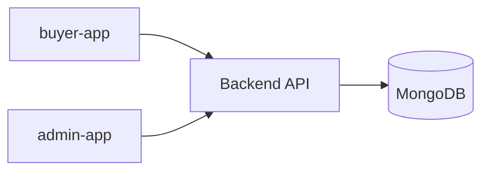
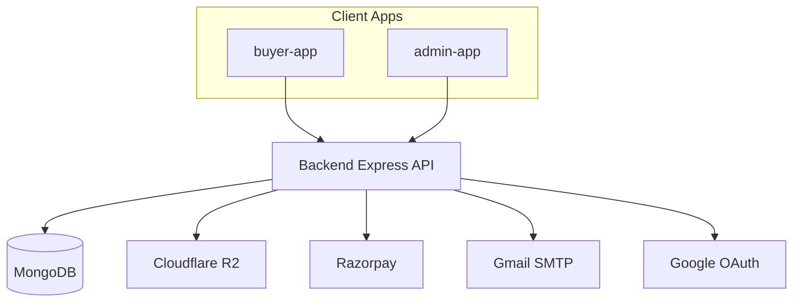
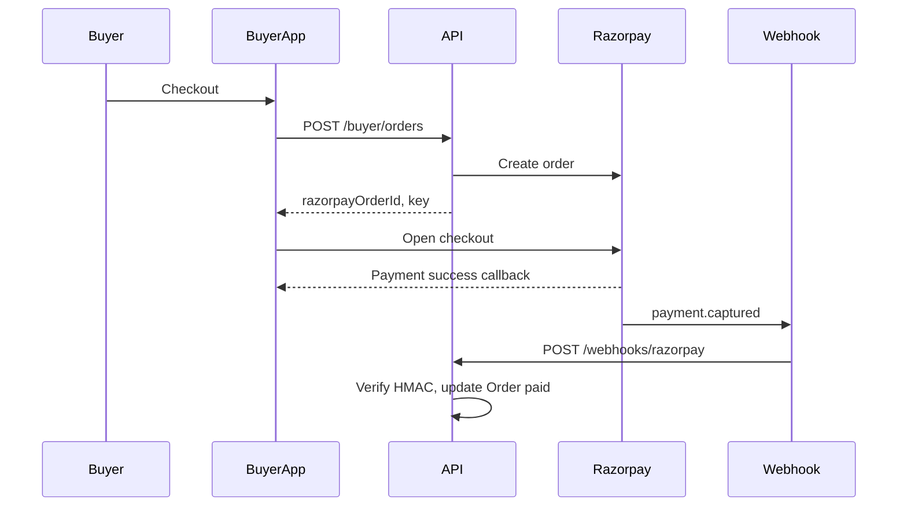
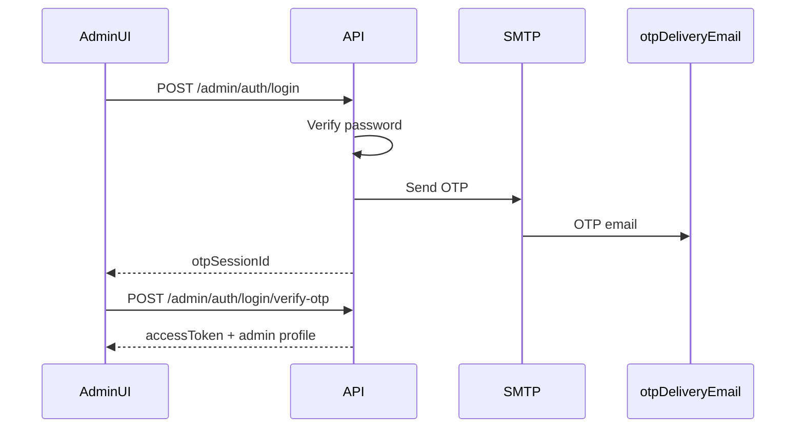

# Software Requirements Specification (SRS)

## LeafFlow — Ornamental Plants Online Store (MERN)

| Field        | Detail                                           |
| ------------ | ------------------------------------------------ |
| Version      | 1.0.0                                            |
| Date         | May 27, 2026                                     |
| Status       | Final (draft for review)                         |
| Stack        | MongoDB, Express, React, Node.js                 |
| Architecture | Monorepo — `Backend` + `buyer-app` + `admin-app` |

---

## Table of Contents

1. [Introduction](#1-introduction)
2. [Overall Description](#2-overall-description)
3. [System Architecture](#3-system-architecture)
4. [Functional Requirements — Buyer App](#4-functional-requirements--buyer-app)
5. [Functional Requirements — Admin App](#5-functional-requirements--admin-app)
6. [Non-Functional Requirements](#6-non-functional-requirements)
7. [Tech Stack & Package Versions](#7-tech-stack--package-versions)
8. [Testing Strategy](#8-testing-strategy)
9. [Project Structure](#9-project-structure)
10. [Data Models](#10-data-models)
11. [API Overview](#11-api-overview)
12. [Security Requirements](#12-security-requirements)
13. [File Storage Strategy](#13-file-storage-strategy)
14. [Payment Flow](#14-payment-flow)
15. [Authentication Flow](#15-authentication-flow)
16. [Constraints & Assumptions](#16-constraints--assumptions)

---

## 1. Introduction

### 1.1 Purpose

This document specifies the software requirements for **LeafFlow**, an online store for selling ornamental plants. The system serves two user types through separate client applications that share a single backend API:

- **buyer-app** — public storefront for customers to browse, purchase, and track orders.
- **admin-app** — internal dashboard for a single store seller to manage catalog, inventory, orders, and customers.

This SRS is the **requirements source of truth**. Delivery checklists and GitHub issue templates live in [milestone.md](milestone.md) and [issues.md](issues.md).

### 1.2 Scope

**In scope (MVP)**

- User authentication (admin and buyer flows as defined in Section 15)
- Product catalog with plant-specific attributes
- Shopping cart and checkout with Razorpay (India)
- Order management and status tracking
- Admin product, category, inventory, and order management
- Image storage via Cloudflare R2
- Email OTP delivery via SMTP (admin and buyer)
- Google OAuth and Google One Tap for buyers

**Out of scope (MVP — documented as Phase 2)**

- Multi-vendor marketplace
- Wishlist, product reviews, coupon codes, guest checkout
- Plant care reminder notifications
- Invoice PDF download, SEO blog
- Mobile native apps

**Infrastructure**

- Monorepo scaffold, CI, Docker, VPS deployment, and SSL staging are tracked in [milestone.md](milestone.md) (M0–M4), not as step-by-step tasks in this document.

### 1.3 Intended Audience

- Developers implementing LeafFlow
- Technical reviewers and future contributors
- Project owners validating scope before implementation

### 1.4 Definitions

| Term                 | Definition                                                                   |
| -------------------- | ---------------------------------------------------------------------------- |
| **Buyer**            | End customer using `buyer-app`                                               |
| **Admin**            | Single store seller using `admin-app`                                        |
| **loginEmail**       | Email address the admin enters to sign in (e.g. `admin@leafflow.com`)        |
| **otpDeliveryEmail** | Email inbox where admin OTP messages are delivered (e.g. `pravin@gmail.com`) |
| **MVP**              | Minimum viable product — must ship before Phase 2                            |
| **Phase 2**          | Post-MVP enhancements explicitly deferred                                    |
| **OTP**              | One-time password (6 digits, 5-minute validity)                              |

---

## 2. Overall Description

### 2.1 Product Perspective

LeafFlow is a **single-seller** e-commerce web application. One admin account manages the entire catalog and fulfillment. Many buyers can register, browse, and place orders. Both client apps communicate with a shared **Express** REST API backed by **MongoDB**.



### 2.2 Product Functions (Summary)

| Function        | Buyer                            | Admin                                                 |
| --------------- | -------------------------------- | ----------------------------------------------------- |
| Authentication  | Email OTP, Google OAuth, One Tap | Email + password + OTP; forgot/reset password via OTP |
| Catalog         | Browse, search, filter           | CRUD products and categories                          |
| Cart & checkout | Cart, address, Razorpay pay      | —                                                     |
| Orders          | View history, track status       | List, update status, cancel/refund                    |
| Inventory       | Stock reflected on product pages | Adjust stock, low-stock alerts                        |
| Dashboard       | —                                | Revenue, orders, alerts                               |

### 2.3 User Classes

| Class | App         | Description                           |
| ----- | ----------- | ------------------------------------- |
| Buyer | `buyer-app` | Registered or OAuth-linked customer   |
| Admin | `admin-app` | Single seller with full store control |

### 2.4 Operating Environment

| Layer           | Requirement                                                                      |
| --------------- | -------------------------------------------------------------------------------- |
| Server runtime  | Node.js 24.x LTS (Krypton)                                                       |
| Database        | MongoDB 8.0 LTS or 8.3.x (latest patch in chosen series)                         |
| Client browsers | Chrome, Firefox, Safari 16+, Edge (latest 2 versions); mobile Safari and Chrome  |
| Deployment      | Docker Compose locally; VPS + Nginx + SSL per [milestone.md](milestone.md) M2–M4 |
| Payments        | Razorpay (India)                                                                 |
| File storage    | Cloudflare R2 (S3-compatible API)                                                |

---

## 3. System Architecture

### 3.1 Architecture Overview

- **Pattern:** Monorepo with npm workspaces; REST API; document database.
- **Backend:** Express 5, TypeScript, Mongoose, modular folders (`controllers`, `services`, `routes`, etc.).
- **buyer-app:** Next.js 16 (App Router) for SEO-friendly storefront.
- **admin-app:** Vite 8 + React 19 SPA for seller dashboard.
- **e2e:** Playwright workspace (planned per M0; not yet in repository).

External integrations: MongoDB, Cloudflare R2, Razorpay, Gmail SMTP, Google OAuth.



### 3.2 Monorepo Structure

```
LeafFlow/
├── Backend/                  # Express API (workspace name: backend)
│   └── src/
│       ├── config/
│       ├── controllers/
│       ├── middleware/
│       ├── models/
│       ├── routes/
│       ├── services/
│       ├── schemas/
│       └── utils/
├── buyer-app/                # Next.js storefront
├── admin-app/                # Vite + React admin dashboard
├── e2e/                      # Playwright tests (planned)
├── docs/
│   ├── SRS.md                # This document
│   ├── milestone.md
│   └── issues.md
├── package.json              # Root workspaces + shared scripts
├── eslint.config.ts
└── tsconfig.base.json
```

**Current implementation state (May 2026):** Monorepo scaffold exists. `Backend` exposes `GET /health`. `buyer-app` and `admin-app` have smoke tests. Commerce and auth features are not yet implemented.

### 3.3 State Management (Client Apps)

| App           | Server / API state                           | Client / UI state                                       |
| ------------- | -------------------------------------------- | ------------------------------------------------------- |
| **admin-app** | **RTK Query** (via `@reduxjs/toolkit`)       | **Redux slices** (auth session, sidebar, table filters) |
| **buyer-app** | **TanStack Query** (`@tanstack/react-query`) | **Zustand** (cart, checkout step, lightweight UI flags) |

**Rationale:** Admin dashboards benefit from Redux DevTools and coordinated cache invalidation across many screens. The buyer storefront favors minimal boilerplate for cart state and TanStack Query for product/order fetching.

---

## 4. Functional Requirements — Buyer App

Requirements use IDs `BUY-xxx`. **Priority:** MVP unless marked Phase 2.

### 4.1 Authentication (MVP)

| ID      | Requirement                                                                                                       |
| ------- | ----------------------------------------------------------------------------------------------------------------- |
| BUY-001 | Buyer shall register or log in using **email OTP** (6-digit code sent to the buyer's email).                      |
| BUY-002 | Buyer shall log in using **Google OAuth** (redirect flow).                                                        |
| BUY-003 | Buyer shall log in using **Google One Tap** (credential JWT posted to backend).                                   |
| BUY-004 | System shall **link accounts** when the same email is used for email OTP and Google (no duplicate buyer records). |
| BUY-005 | Buyer shall view and edit profile (name, phone optional, saved addresses).                                        |
| BUY-006 | Buyer shall log out and invalidate refresh token.                                                                 |

### 4.2 Catalog (MVP)

| ID      | Requirement                                                                                           |
| ------- | ----------------------------------------------------------------------------------------------------- |
| BUY-010 | Buyer shall browse products with pagination.                                                          |
| BUY-011 | Buyer shall filter by category, price range, light requirement, and availability (in stock).          |
| BUY-012 | Buyer shall search by product name and common/scientific name.                                        |
| BUY-013 | Buyer shall view product detail: images, price, stock, description, care attributes (see Section 10). |

### 4.3 Cart (MVP)

| ID      | Requirement                                                                                                            |
| ------- | ---------------------------------------------------------------------------------------------------------------------- |
| BUY-020 | Buyer shall add, update quantity, and remove items in cart (Zustand + server sync optional for logged-in persistence). |
| BUY-021 | Cart shall not allow quantity above available stock.                                                                   |

### 4.4 Checkout & Orders (MVP)

| ID      | Requirement                                                                                                           |
| ------- | --------------------------------------------------------------------------------------------------------------------- |
| BUY-030 | Buyer shall enter or select a delivery address at checkout.                                                           |
| BUY-031 | Buyer shall pay via **Razorpay** and see payment success/failure status.                                              |
| BUY-032 | Buyer shall view order history and order detail with status: `placed`, `packed`, `shipped`, `delivered`, `cancelled`. |

### 4.5 Static Content (MVP)

| ID      | Requirement                                                                 |
| ------- | --------------------------------------------------------------------------- |
| BUY-040 | Buyer shall access pages: About, Shipping policy, Returns/refunds, Contact. |

### 4.6 Phase 2 (Deferred)

| ID      | Requirement                         |
| ------- | ----------------------------------- |
| BUY-P01 | Wishlist / favorites                |
| BUY-P02 | Product reviews and ratings         |
| BUY-P03 | Coupon / discount codes at checkout |
| BUY-P04 | Guest checkout (no account)         |
| BUY-P05 | Plant care email reminders          |
| BUY-P06 | Order invoice PDF download          |
| BUY-P07 | SEO blog / care articles            |

---

## 5. Functional Requirements — Admin App

Requirements use IDs `ADM-xxx`. Authentication detail in Section 15.

### 5.1 Authentication (MVP)

| ID      | Requirement                                                                                                             |
| ------- | ----------------------------------------------------------------------------------------------------------------------- |
| ADM-001 | Admin shall log in with **loginEmail + password**, then complete **OTP verification** (OTP sent to `otpDeliveryEmail`). |
| ADM-002 | Admin shall use **forgot password**: request OTP → verify OTP → set new password.                                       |
| ADM-003 | Logged-in admin shall **reset password** via OTP sent to `otpDeliveryEmail` (optional current password verification).   |
| ADM-004 | Admin auth shall **not** support Google OAuth or One Tap.                                                               |

### 5.2 Dashboard (MVP)

| ID      | Requirement                                                                                             |
| ------- | ------------------------------------------------------------------------------------------------------- |
| ADM-010 | Admin shall see summary: total orders, revenue (period), pending orders count, low-stock product count. |

### 5.3 Products & Categories (MVP)

| ID      | Requirement                                                                                             |
| ------- | ------------------------------------------------------------------------------------------------------- |
| ADM-020 | Admin shall create, read, update, delete products including images, price, stock, and plant attributes. |
| ADM-021 | Admin shall create, read, update, delete categories.                                                    |
| ADM-022 | Admin shall upload product images (stored in R2 public bucket).                                         |

### 5.4 Inventory (MVP)

| ID      | Requirement                                                                  |
| ------- | ---------------------------------------------------------------------------- |
| ADM-030 | Admin shall adjust stock quantities and set low-stock threshold per product. |
| ADM-031 | System shall flag products below threshold on dashboard.                     |

### 5.5 Orders & Customers (MVP)

| ID      | Requirement                                                                   |
| ------- | ----------------------------------------------------------------------------- |
| ADM-040 | Admin shall list and filter orders; update order status.                      |
| ADM-041 | Admin shall cancel orders and initiate refund workflow (Razorpay refund API). |
| ADM-042 | Admin shall view buyer list and per-buyer order history.                      |

### 5.6 Settings (MVP)

| ID      | Requirement                                                               |
| ------- | ------------------------------------------------------------------------- |
| ADM-050 | Admin shall configure store name, contact info, and delivery zones/rules. |

### 5.7 Phase 2 (Deferred)

| ID      | Requirement                          |
| ------- | ------------------------------------ |
| ADM-P01 | Discount / coupon management         |
| ADM-P02 | Sales reports (daily/monthly charts) |
| ADM-P03 | Bulk product CSV import/export       |
| ADM-P04 | Admin activity audit log             |
| ADM-P05 | Customizable email templates         |

---

## 6. Non-Functional Requirements

### 6.1 Performance

- API p95 response time &lt; 500 ms for catalog reads under normal load (excluding image CDN).
- Product list pages shall support pagination (default 20 items per page).
- Images served via R2 CDN; not proxied through API for static assets.

### 6.2 Scalability

- Stateless API instances behind reverse proxy (horizontal scale ready).
- MongoDB indexes on frequently queried fields (see Section 10).
- Optional Phase 2: Redis + BullMQ for email and webhook job queues.

### 6.3 Reliability

- Payment state must be reconciled via Razorpay webhooks (idempotent processing).
- Health endpoint `GET /health` for load balancer checks.
- Database connection retry on startup.

### 6.4 Maintainability

- All environment-specific configuration via `.env` files (never committed).
- TypeScript strict mode across `Backend`, `buyer-app`, and `admin-app`.
- ESLint + Prettier enforced at monorepo root.
- Code coverage targets (Section 8.5).

### 6.5 Accessibility

- Buyer storefront shall meet WCAG 2.1 Level AA baseline (semantic HTML, keyboard nav, form labels, contrast).
- Admin app shall use accessible form controls and focus management on modals.

### 6.6 Browser Support

- Chrome (latest 2 versions)
- Firefox (latest 2 versions)
- Safari 16+
- Edge (latest 2 versions)
- Mobile: iOS Safari, Android Chrome

### 6.7 Security (NFR summary)

- HTTPS required in production.
- Rate limiting on all OTP and login endpoints.
- OTP stored hashed; generic messages for enumeration-safe responses.
- See Section 12 for full security requirements.

---

## 7. Tech Stack & Package Versions

Pin to **latest stable patch** within the stated series at implementation time. Versions below reflect May 2026 research and current repo scaffolds.

### 7.1 Runtime & Core

| Technology | Version                          | Notes                                            |
| ---------- | -------------------------------- | ------------------------------------------------ |
| Node.js    | 24.x LTS (Krypton), e.g. 24.16.0 | Production recommended; repo engines `>=24.15.0` |
| TypeScript | 6.0.3                            | Shared across monorepo                           |
| React      | 19.2.6                           | Patched release (security fixes May 2026)        |
| MongoDB    | 8.0 LTS or 8.3.x                 | Latest patch in chosen series                    |
| Mongoose   | 9.6.2                            | ODM for MongoDB 8                                |

### 7.2 Backend Packages

| Package                 | Version   | Purpose                             |
| ----------------------- | --------- | ----------------------------------- |
| `express`               | 5.2.1     | HTTP server                         |
| `mongoose`              | 9.6.2     | MongoDB ODM                         |
| `zod`                   | 3.25.x    | Request validation                  |
| `dotenv`                | 17.x      | Environment loading                 |
| `helmet`                | 8.x       | Security headers                    |
| `cors`                  | 2.8.x     | CORS                                |
| `express-rate-limit`    | 7.x       | Rate limiting                       |
| `bcrypt`                | 6.x       | Password hashing                    |
| `jsonwebtoken` / `jose` | 9.x / 6.x | JWT (RS256 access tokens per env)   |
| `nodemailer`            | 7.x       | SMTP / admin & buyer OTP email      |
| `google-auth-library`   | 10.x      | Google OAuth / One Tap verification |
| `razorpay`              | 2.x       | Payments                            |
| `@aws-sdk/client-s3`    | 3.x       | Cloudflare R2 (S3-compatible)       |
| `pino` + `pino-http`    | 9.x       | Structured logging                  |
| `vitest`                | 4.1.7     | Test runner                         |
| `supertest`             | 7.2.2     | API integration tests               |
| `msw`                   | 2.14.x    | Mock external services in tests     |
| `tsx`                   | 4.x       | Dev execution (current scaffold)    |
| `bullmq` + `ioredis`    | optional  | Background jobs (Phase 2 scale)     |

### 7.3 Frontend Packages — buyer-app

| Package                          | Version  | Purpose                           |
| -------------------------------- | -------- | --------------------------------- |
| `next`                           | 16.2.6   | Storefront framework (App Router) |
| `react` / `react-dom`            | 19.2.6   | UI                                |
| `@tanstack/react-query`          | 5.100.14 | Server state / API cache          |
| `@tanstack/react-query-devtools` | 5.100.14 | Dev debugging                     |
| `zustand`                        | 5.0.13   | Cart, checkout UI state           |
| `tailwindcss`                    | 4.3.0    | Styling                           |
| `daisyui`                        | 5.5.x    | UI components                     |
| `vitest`                         | 4.1.7    | Unit/component tests              |
| `@testing-library/react`         | 16.x     | Component tests                   |
| `msw`                            | 2.14.x   | API mocking                       |
| `happy-dom`                      | 20.x     | Test DOM                          |

### 7.4 Frontend Packages — admin-app

| Package                  | Version | Purpose                                      |
| ------------------------ | ------- | -------------------------------------------- |
| `vite`                   | 8.0.12  | Build tool                                   |
| `react` / `react-dom`    | 19.2.6  | UI                                           |
| `react-router-dom`       | 7.15.x  | Routing                                      |
| `@reduxjs/toolkit`       | 2.12.0  | Redux + RTK Query                            |
| `react-redux`            | 9.2.x   | React bindings                               |
| `axios`                  | 1.16.x  | HTTP client (optional; RTK Query fetch base) |
| `tailwindcss`            | 4.3.0   | Styling                                      |
| `daisyui`                | 5.5.x   | UI components                                |
| `vitest`                 | 4.1.7   | Tests                                        |
| `@testing-library/react` | 16.x    | Component tests                              |
| `msw`                    | 2.14.x  | API mocking                                  |
| `happy-dom`              | 20.x    | Test DOM                                     |

### 7.5 E2E

| Package            | Version | Purpose                                   |
| ------------------ | ------- | ----------------------------------------- |
| `@playwright/test` | 1.60.0  | Cross-browser E2E (OAuth, Razorpay flows) |

---

## 8. Testing Strategy

### 8.1 Testing Layers

| Layer            | Tools                            | Scope                                                 |
| ---------------- | -------------------------------- | ----------------------------------------------------- |
| Unit / Component | Vitest 4 + React Testing Library | Components, Redux slices, Zustand stores, utilities   |
| API Integration  | Vitest 4 + Supertest 7.2.2       | Express routes, auth middleware, webhook verification |
| API Mocking      | MSW 2                            | Frontend tests without live backend                   |
| End-to-End       | Playwright 1.60                  | Critical journeys in Chromium, Firefox, WebKit        |

### 8.2 Frontend Testing Packages

| Package                       | Version | Purpose             |
| ----------------------------- | ------- | ------------------- |
| `vitest`                      | 4.1.7   | Test runner         |
| `@vitest/coverage-v8`         | 4.1.7   | Coverage            |
| `@testing-library/react`      | 16.x    | Component rendering |
| `@testing-library/user-event` | 14.x    | User interactions   |
| `@testing-library/jest-dom`   | 6.x     | DOM matchers        |
| `happy-dom`                   | 20.x    | DOM environment     |
| `msw`                         | 2.14.x  | Network mocking     |

### 8.3 Backend Testing Packages

| Package     | Version | Purpose                    |
| ----------- | ------- | -------------------------- |
| `vitest`    | 4.1.7   | Test runner                |
| `supertest` | 7.2.2   | HTTP integration tests     |
| `msw`       | 2.14.x  | Mock Razorpay, R2 in tests |

### 8.4 E2E Testing Package

| Package            | Version | Notes                                                             |
| ------------------ | ------- | ----------------------------------------------------------------- |
| `@playwright/test` | 1.60.0  | Required for Google OAuth multi-origin and Razorpay popup testing |

### 8.5 Coverage Targets

| App       | Scope                              | Target |
| --------- | ---------------------------------- | ------ |
| Backend   | Route handlers                     | ≥ 70%  |
| Backend   | Services (payment, storage, email) | ≥ 80%  |
| Backend   | Auth middleware                    | ≥ 90%  |
| admin-app | Components                         | ≥ 60%  |
| admin-app | Redux slices                       | ≥ 85%  |
| buyer-app | Components                         | ≥ 60%  |

### 8.6 Critical E2E Scenarios

Must pass before staging deployment:

1. **Admin login** — email + password → OTP → dashboard access.
2. **Admin forgot password** — OTP → new password → login with new password.
3. **Buyer email OTP** — send OTP → verify → session established.
4. **Buyer Google OAuth** — redirect flow completes and creates/links account.
5. **Purchase flow** — browse product → add to cart → checkout → Razorpay test payment → order `placed`.
6. **Admin product publish** — create product in admin → visible on buyer catalog.

---

## 9. Project Structure

### 9.1 Backend (`Backend/`)

```
Backend/
├── src/
│   ├── app.ts              # Express app, middleware
│   ├── index.ts            # Server entry, DB connect
│   ├── config/             # env, db, razorpay, r2
│   ├── controllers/
│   ├── middleware/         # auth, validate, errorHandler
│   ├── models/             # Mongoose schemas
│   ├── routes/             # /api/admin, /api/buyer, /api/webhooks
│   ├── services/           # otp, email, payment, storage
│   ├── schemas/            # Zod request schemas
│   └── utils/
├── __tests__/
├── vitest.config.ts
├── tsconfig.json
└── .env.example            # Pending alignment with Section 16
```

### 9.2 buyer-app

```
buyer-app/
├── app/                    # Next.js App Router pages
├── src/
│   ├── components/
│   ├── hooks/              # TanStack Query hooks
│   ├── stores/             # Zustand (cart, checkout)
│   ├── lib/                # api client
│   └── mocks/              # MSW handlers
├── public/
└── .env.example
```

### 9.3 admin-app

```
admin-app/
├── src/
│   ├── app/ or pages/      # Route components
│   ├── features/           # products, orders, auth
│   ├── store/              # Redux store, RTK Query APIs, slices
│   ├── components/
│   └── mocks/
├── index.html
└── .env.example
```

### 9.4 e2e (planned)

```
e2e/
├── buyer/
├── admin/
└── playwright.config.ts
```

---

## 10. Data Models

All models use MongoDB via Mongoose. Timestamps (`createdAt`, `updatedAt`) on all collections unless noted.

### 10.1 Admin

| Field                 | Type    | Notes                    |
| --------------------- | ------- | ------------------------ |
| `loginEmail`          | string  | Unique; entered at login |
| `otpDeliveryEmail`    | string  | OTP recipient inbox      |
| `passwordHash`        | string  | bcrypt                   |
| `name`                | string  | Display name             |
| `role`                | string  | Always `admin`           |
| `isActive`            | boolean | Default true             |
| `failedLoginAttempts` | number  | Lockout counter          |
| `lockUntil`           | Date    | Optional account lock    |
| `lastLoginAt`         | Date    |                          |
| `passwordChangedAt`   | Date    |                          |

**Seed example:** `loginEmail`: `admin@leafflow.com`, `otpDeliveryEmail`: `pravin@gmail.com`

**Indexes:** unique `loginEmail`

### 10.2 OtpSession

| Field                   | Type     | Notes                                                       |
| ----------------------- | -------- | ----------------------------------------------------------- |
| `adminId` or `userId`   | ObjectId | Nullable for buyer-only OTP                                 |
| `loginEmail` or `email` | string   | Identifier used at request                                  |
| `deliveryEmail`         | string   | Where OTP was sent                                          |
| `purpose`               | enum     | `login`, `forgot_password`, `reset_password`, `buyer_login` |
| `otpHash`               | string   | Never store plain OTP                                       |
| `attempts`              | number   | Max 5                                                       |
| `expiresAt`             | Date     | now + 5 minutes                                             |
| `isUsed`                | boolean  |                                                             |

**Indexes:** TTL index on `expiresAt` (optional cleanup)

### 10.3 RefreshToken

| Field        | Type     | Notes            |
| ------------ | -------- | ---------------- |
| `userId`     | ObjectId | Admin or Buyer   |
| `role`       | enum     | `admin`, `buyer` |
| `tokenHash`  | string   |                  |
| `deviceInfo` | string   | Optional         |
| `expiresAt`  | Date     | 7 days default   |
| `revoked`    | boolean  |                  |

### 10.4 User (Buyer)

| Field        | Type    | Notes                                        |
| ------------ | ------- | -------------------------------------------- |
| `email`      | string  | Unique, lowercase                            |
| `googleId`   | string  | Optional                                     |
| `name`       | string  |                                              |
| `phone`      | string  | Optional                                     |
| `addresses`  | array   | `{ line1, city, state, pincode, isDefault }` |
| `role`       | string  | `buyer`                                      |
| `isVerified` | boolean |                                              |

**Indexes:** unique `email`; sparse unique `googleId`

### 10.5 Category

| Field         | Type    | Notes    |
| ------------- | ------- | -------- |
| `name`        | string  |          |
| `slug`        | string  | Unique   |
| `description` | string  | Optional |
| `isActive`    | boolean |          |

### 10.6 Product

| Field               | Type     | Notes                                     |
| ------------------- | -------- | ----------------------------------------- |
| `name`              | string   |                                           |
| `slug`              | string   | Unique                                    |
| `description`       | string   |                                           |
| `categoryId`        | ObjectId | ref Category                              |
| `price`             | number   | INR paise or rupees (pick one convention) |
| `compareAtPrice`    | number   | Optional                                  |
| `stock`             | number   |                                           |
| `lowStockThreshold` | number   | Default e.g. 5                            |
| `images`            | string[] | R2 public URLs                            |
| `scientificName`    | string   | Optional                                  |
| `commonName`        | string   |                                           |
| `lightRequirement`  | enum     | `low`, `medium`, `bright_indirect`        |
| `waterFrequency`    | string   | e.g. "twice weekly"                       |
| `humidityLevel`     | enum     | `low`, `medium`, `high`                   |
| `petFriendly`       | boolean  |                                           |
| `potSize`           | string   | e.g. "6 inch"                             |
| `plantHeight`       | string   | e.g. "30–40 cm"                           |
| `careInstructions`  | string   |                                           |
| `isActive`          | boolean  | Hidden when false                         |

**Indexes:** `categoryId`, text index on `name`, `commonName`, `scientificName`

### 10.7 Cart

| Field    | Type     | Notes                                 |
| -------- | -------- | ------------------------------------- |
| `userId` | ObjectId | Buyer                                 |
| `items`  | array    | `{ productId, quantity, priceAtAdd }` |

**Indexes:** unique `userId`

### 10.8 Order

| Field                              | Type     | Notes                                                   |
| ---------------------------------- | -------- | ------------------------------------------------------- |
| `orderNumber`                      | string   | Unique human-readable                                   |
| `userId`                           | ObjectId | Buyer                                                   |
| `items`                            | array    | Snapshot: productId, name, price, quantity              |
| `shippingAddress`                  | object   |                                                         |
| `subtotal`, `shippingFee`, `total` | number   |                                                         |
| `status`                           | enum     | `placed`, `packed`, `shipped`, `delivered`, `cancelled` |
| `paymentStatus`                    | enum     | `pending`, `paid`, `failed`, `refunded`                 |
| `razorpayOrderId`                  | string   |                                                         |
| `razorpayPaymentId`                | string   |                                                         |

### 10.9 Payment (audit log)

| Field             | Type     | Notes            |
| ----------------- | -------- | ---------------- |
| `orderId`         | ObjectId |                  |
| `razorpayEventId` | string   | Idempotency      |
| `amount`          | number   |                  |
| `status`          | string   |                  |
| `rawPayload`      | object   | Webhook snapshot |

---

## 11. API Overview

Base URL: `/api`. JSON request/response. Errors: `{ success: false, code: string, message: string }`.

### 11.1 Health

| Method | Path      | Auth | Description        |
| ------ | --------- | ---- | ------------------ |
| GET    | `/health` | None | `{ status: "ok" }` |

### 11.2 Admin Authentication

| Method | Path                                   | Auth    | Description                                        |
| ------ | -------------------------------------- | ------- | -------------------------------------------------- |
| POST   | `/admin/auth/login`                    | None    | Validate password; send OTP; return `otpSessionId` |
| POST   | `/admin/auth/login/verify-otp`         | None    | Verify OTP; issue tokens                           |
| POST   | `/admin/auth/forgot-password/send-otp` | None    | Send OTP for reset                                 |
| POST   | `/admin/auth/forgot-password/reset`    | None    | Verify OTP + set new password                      |
| POST   | `/admin/auth/reset-password/send-otp`  | Admin   | Send OTP for logged-in reset                       |
| POST   | `/admin/auth/reset-password/confirm`   | Admin   | OTP + new password                                 |
| POST   | `/admin/auth/refresh`                  | Refresh | New access token                                   |
| POST   | `/admin/auth/logout`                   | Admin   | Revoke refresh token                               |
| GET    | `/admin/auth/me`                       | Admin   | Current admin profile                              |

**POST `/admin/auth/login` — request**

```json
{ "loginEmail": "admin@leafflow.com", "password": "********" }
```

**Success (200)**

```json
{
  "success": true,
  "otpRequired": true,
  "otpSessionId": "64f1a2b3c4d5e6f7a8b9c0d1",
  "message": "OTP sent to registered email.",
  "expiresInSeconds": 300
}
```

**POST `/admin/auth/login/verify-otp` — request**

```json
{
  "loginEmail": "admin@leafflow.com",
  "otpSessionId": "64f1a2b3c4d5e6f7a8b9c0d1",
  "otp": "123456"
}
```

**Auth error codes:** `INVALID_CREDENTIALS`, `ACCOUNT_LOCKED`, `ACCOUNT_INACTIVE`, `OTP_INVALID`, `OTP_EXPIRED`, `OTP_MAX_ATTEMPTS`, `OTP_SESSION_NOT_FOUND`, `RATE_LIMITED`

### 11.3 Buyer Authentication

| Method | Path                           | Auth    | Description              |
| ------ | ------------------------------ | ------- | ------------------------ |
| POST   | `/buyer/auth/email/send-otp`   | None    | Send OTP to buyer email  |
| POST   | `/buyer/auth/email/verify-otp` | None    | Verify OTP; issue tokens |
| GET    | `/buyer/auth/google`           | None    | OAuth redirect           |
| GET    | `/buyer/auth/google/callback`  | None    | OAuth callback           |
| POST   | `/buyer/auth/google/one-tap`   | None    | Body: `{ credential }`   |
| POST   | `/buyer/auth/refresh`          | Refresh | New access token         |
| POST   | `/buyer/auth/logout`           | Buyer   | Revoke refresh           |
| GET    | `/buyer/auth/me`               | Buyer   | Profile                  |

### 11.4 Buyer Commerce

| Method | Path                    | Auth     | Description                   |
| ------ | ----------------------- | -------- | ----------------------------- |
| GET    | `/buyer/products`       | Optional | List + filters                |
| GET    | `/buyer/products/:slug` | Optional | Product detail                |
| GET    | `/buyer/categories`     | Optional | Active categories             |
| GET    | `/buyer/cart`           | Buyer    | Get cart                      |
| PUT    | `/buyer/cart`           | Buyer    | Sync cart items               |
| POST   | `/buyer/orders`         | Buyer    | Create order + Razorpay order |
| GET    | `/buyer/orders`         | Buyer    | Order history                 |
| GET    | `/buyer/orders/:id`     | Buyer    | Order detail                  |

### 11.5 Admin Management

| Method    | Path                          | Auth  | Description                 |
| --------- | ----------------------------- | ----- | --------------------------- |
| GET       | `/admin/dashboard`            | Admin | Summary stats               |
| CRUD      | `/admin/products`             | Admin | Product management          |
| CRUD      | `/admin/categories`           | Admin | Categories                  |
| GET/PATCH | `/admin/orders`               | Admin | Orders list / status update |
| GET       | `/admin/customers`            | Admin | Buyer list                  |
| GET       | `/admin/customers/:id/orders` | Admin | Buyer order history         |
| POST      | `/admin/uploads/presign`      | Admin | R2 presigned upload URL     |

### 11.6 Webhooks

| Method | Path                 | Auth           | Description             |
| ------ | -------------------- | -------------- | ----------------------- |
| POST   | `/webhooks/razorpay` | HMAC signature | Payment captured/failed |

---

## 12. Security Requirements

| ID     | Requirement                                                                                                     |
| ------ | --------------------------------------------------------------------------------------------------------------- |
| SEC-01 | Access tokens: JWT RS256, 15-minute TTL (`JWT_PRIVATE_KEY` / `JWT_PUBLIC_KEY`).                                 |
| SEC-02 | Refresh tokens: 7-day TTL, stored hashed, httpOnly cookie recommended for web clients.                          |
| SEC-03 | Separate route namespaces: `/api/admin/*` vs `/api/buyer/*`; middleware enforces role.                          |
| SEC-04 | Passwords hashed with bcrypt (cost factor ≥ 12).                                                                |
| SEC-05 | OTP: 6 digits, 5-minute expiry, max 5 attempts, stored as hash only.                                            |
| SEC-06 | Rate limit: 3 OTP sends per 15 minutes per identifier; 5 failed logins → 15-minute lock.                        |
| SEC-07 | Generic responses for forgot-password / unknown email enumeration.                                              |
| SEC-08 | `helmet`, CORS allowlist (`CORS_ORIGIN`), `express-rate-limit` on auth routes.                                  |
| SEC-09 | Razorpay webhooks verified with `RAZORPAY_WEBHOOK_SECRET`; idempotent event processing.                         |
| SEC-10 | No secrets in client bundles; only public keys (`VITE_RAZORPAY_KEY`, `VITE_GOOGLE_CLIENT_ID`, `NEXT_PUBLIC_*`). |
| SEC-11 | Revoke all refresh tokens on admin password reset.                                                              |
| SEC-12 | HTTPS only in production; secure cookie flags.                                                                  |

---

## 13. File Storage Strategy

| Bucket              | Access                           | Content            |
| ------------------- | -------------------------------- | ------------------ |
| `R2_PUBLIC_BUCKET`  | Public via CDN (`R2_PUBLIC_URL`) | Product images     |
| `R2_PRIVATE_BUCKET` | Presigned URLs only              | Invoices (Phase 2) |

**Upload flow**

1. Admin requests presigned PUT URL from `POST /api/admin/uploads/presign`.
2. Admin-app uploads directly to R2.
3. Product record stores final public CDN URL.

**Constraints:** Max image size 5 MB; types `image/jpeg`, `image/png`, `image/webp`. Virus scanning optional Phase 2.

---

## 14. Payment Flow



| Step | Description                                                                             |
| ---- | --------------------------------------------------------------------------------------- |
| 1    | Buyer submits checkout; API creates `Order` with `paymentStatus: pending`.              |
| 2    | API creates Razorpay order; returns `orderId` + amount to client.                       |
| 3    | Buyer completes Razorpay checkout (popup/redirect).                                     |
| 4    | Razorpay sends webhook; API verifies signature and marks order `paid`, status `placed`. |
| 5    | Client polls or redirects to success page showing order confirmation.                   |

**Refund:** Admin triggers refund via admin-app → API calls Razorpay refund API → updates `paymentStatus: refunded`.

**Environment:** `RAZORPAY_KEY_ID`, `RAZORPAY_KEY_SECRET`, `RAZORPAY_WEBHOOK_SECRET`, `VITE_RAZORPAY_KEY` / `NEXT_PUBLIC_RAZORPAY_KEY` (client).

---

## 15. Authentication Flow

### 15.1 Admin Authentication

**Methods:** Email + password, then OTP. Forgot password and reset password via OTP. **Not supported:** OAuth, One Tap, mobile OTP.

**Email mapping**

| Field              | Example              | Usage                                    |
| ------------------ | -------------------- | ---------------------------------------- |
| `loginEmail`       | `admin@leafflow.com` | Entered on login / forgot-password forms |
| `otpDeliveryEmail` | `pravin@gmail.com`   | Receives all admin OTP emails            |

#### 15.1.1 Login (password + OTP)



1. Admin submits `loginEmail` + `password`.
2. Backend validates credentials (active account, not locked).
3. Backend creates `OtpSession` (`purpose: login`), emails OTP to `otpDeliveryEmail`.
4. Admin enters OTP; backend verifies and issues JWT + refresh token.

#### 15.1.2 Forgot Password

1. Admin enters `loginEmail`.
2. OTP sent to `otpDeliveryEmail` (`purpose: forgot_password`).
3. Admin submits OTP + `newPassword` + `confirmPassword`.
4. Password updated; all refresh tokens revoked.

#### 15.1.3 Reset Password (authenticated)

1. Admin calls `reset-password/send-otp` (optional: verify `currentPassword` first).
2. OTP sent to `otpDeliveryEmail`.
3. Admin submits OTP + new password via `reset-password/confirm`.
4. Recommend force re-login after success.

#### 15.1.4 Admin UI Routes

| Route                | Purpose                             |
| -------------------- | ----------------------------------- |
| `/login`             | Email + password                    |
| `/login/verify-otp`  | OTP entry                           |
| `/forgot-password`   | Request + verify OTP + new password |
| `/settings/security` | Reset password while logged in      |

#### 15.1.5 Email Template (OTP)

**Subject:** `LeafFlow Admin — Verification code`

**Body (example):**

```text
Your LeafFlow admin verification code is: 123456

This code expires in 5 minutes.
Login email: admin@leafflow.com

If you did not request this, ignore this email.
```

**SMTP:** Gmail (`smtp.gmail.com:587`) with app password; `MAIL_FROM` e.g. `LeafFlow Admin <pravin@gmail.com>`.

### 15.2 Buyer Authentication

| Method         | Flow                                                          |
| -------------- | ------------------------------------------------------------- |
| Email OTP      | `send-otp` → `verify-otp` → JWT                               |
| Google OAuth   | Redirect to Google → callback → verify → JWT                  |
| Google One Tap | POST credential JWT → verify with `google-auth-library` → JWT |

**Account linking:** If Google account email matches existing buyer email, merge `googleId` onto existing user document.

**Not in MVP:** Buyer forgot-password via separate flow (can use email OTP login as recovery).

### 15.3 Admin vs Buyer Comparison

|                 | Admin                        | Buyer                              |
| --------------- | ---------------------------- | ---------------------------------- |
| Login           | Email + password + OTP       | Email OTP / Google OAuth / One Tap |
| OTP destination | `otpDeliveryEmail` (mapped)  | User's own email                   |
| Password        | Required (with forgot/reset) | Not required for OTP/OAuth login   |
| OAuth / One Tap | No                           | Yes                                |
| Token routes    | `/api/admin/auth/*`          | `/api/buyer/auth/*`                |
| Client state    | Redux + RTK Query            | TanStack Query + Zustand           |

---

## 16. Constraints & Assumptions

### 16.1 Business Constraints

- **Single seller:** One admin account at launch; no multi-tenant marketplace.
- **Geography / payments:** India-first; Razorpay as primary payment gateway.
- **Currency:** INR.

### 16.2 Technical Assumptions

- MongoDB hosted on Atlas or self-managed MongoDB 8.x.
- `e2e/` workspace will be added per [milestone.md](milestone.md) M0 (not present in repo yet).
- `Backend/.env.example` is **pending alignment** with this SRS (currently contains PostgreSQL placeholders from early scaffold).
- Workspace folder is `Backend/` (capital B); npm workspace package name is `backend`.

### 16.3 Implementation Tracking

- Infrastructure delivery: [milestone.md](milestone.md) (M0–M4).
- GitHub issue decomposition: [issues.md](issues.md).
- Package versions for new dependencies: Section 7.2–7.4 of this document.

### 16.4 Environment Variables Reference

| Variable                       | Used By   | Description                               |
| ------------------------------ | --------- | ----------------------------------------- |
| `NODE_ENV`                     | Backend   | `development` / `production`              |
| `PORT`                         | Backend   | HTTP port (default `5000`)                |
| `MONGODB_URI`                  | Backend   | MongoDB connection string                 |
| `JWT_PRIVATE_KEY`              | Backend   | RS256 private key (PEM) for access tokens |
| `JWT_PUBLIC_KEY`               | Backend   | RS256 public key (PEM) for verification   |
| `REFRESH_TOKEN_SECRET`         | Backend   | HMAC secret for hashing refresh tokens    |
| `GOOGLE_CLIENT_ID`             | Backend   | Google OAuth client ID                    |
| `RAZORPAY_KEY_ID`              | Backend   | Razorpay API key                          |
| `RAZORPAY_KEY_SECRET`          | Backend   | Razorpay API secret                       |
| `RAZORPAY_WEBHOOK_SECRET`      | Backend   | Webhook HMAC secret                       |
| `R2_ACCOUNT_ID`                | Backend   | Cloudflare account ID                     |
| `R2_ACCESS_KEY_ID`             | Backend   | R2 access key                             |
| `R2_SECRET_ACCESS_KEY`         | Backend   | R2 secret key                             |
| `R2_PUBLIC_BUCKET`             | Backend   | Public bucket (product images)            |
| `R2_PRIVATE_BUCKET`            | Backend   | Private bucket (invoices Phase 2)         |
| `R2_PUBLIC_URL`                | Backend   | CDN base URL for public bucket            |
| `SMTP_HOST`                    | Backend   | SMTP hostname (e.g. `smtp.gmail.com`)     |
| `SMTP_PORT`                    | Backend   | SMTP port (587 TLS)                       |
| `SMTP_USER`                    | Backend   | SMTP username                             |
| `SMTP_PASS`                    | Backend   | SMTP app password                         |
| `MAIL_FROM`                    | Backend   | From header for outbound mail             |
| `ADMIN_LOGIN_EMAIL`            | Backend   | Seed default admin login email            |
| `ADMIN_OTP_EMAIL`              | Backend   | Seed default OTP delivery email           |
| `ADMIN_PASSWORD`               | Backend   | Seed default admin password (dev only)    |
| `CORS_ORIGIN`                  | Backend   | Comma-separated allowed origins           |
| `VITE_API_URL`                 | admin-app | Backend base URL                          |
| `NEXT_PUBLIC_API_URL`          | buyer-app | Backend base URL                          |
| `VITE_GOOGLE_CLIENT_ID`        | admin-app | Not used for admin (buyer only if shared) |
| `NEXT_PUBLIC_GOOGLE_CLIENT_ID` | buyer-app | Google OAuth / One Tap                    |
| `VITE_RAZORPAY_KEY`            | admin-app | Optional                                  |
| `NEXT_PUBLIC_RAZORPAY_KEY`     | buyer-app | Razorpay public key                       |

### 16.5 Password Policy (Admin)

- Minimum 8 characters
- At least one uppercase, one lowercase, one digit
- Optional: one special character

---

_End of SRS Document — Version 1.0.0_
